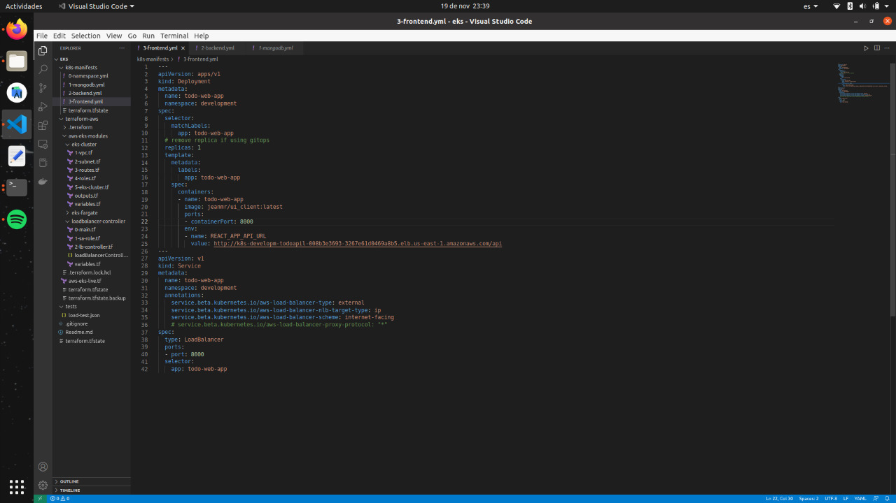
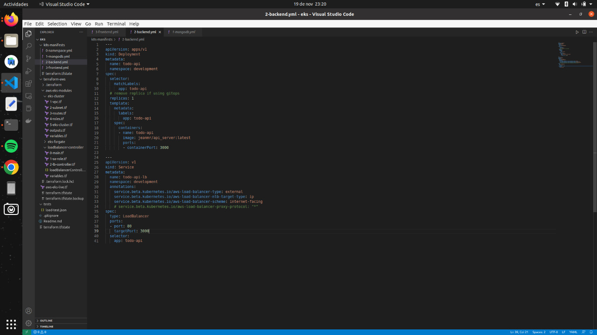
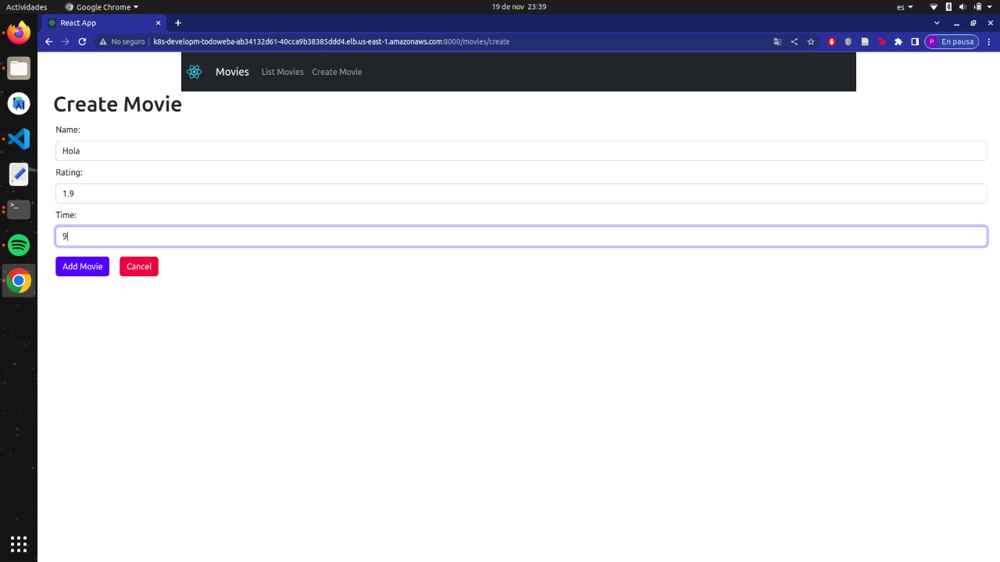
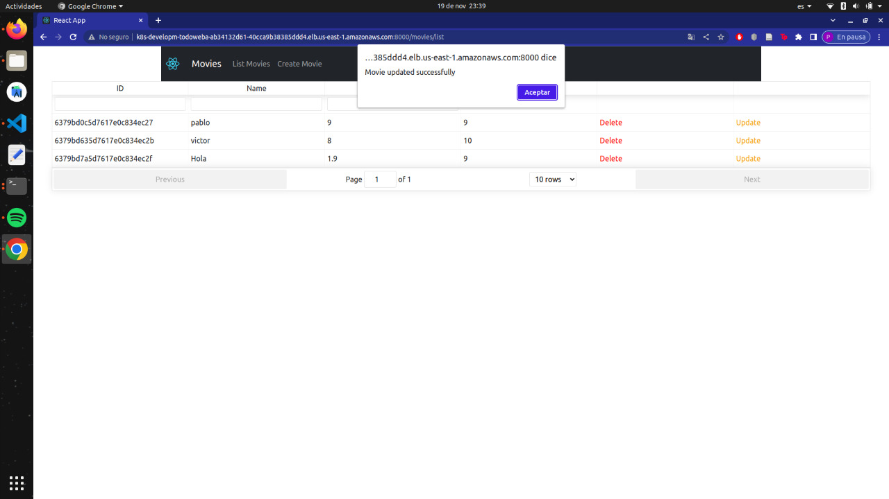

# Moviesdata-Cloud
Proyecto Cloud UFM '22
## Instrucciones para correr:
1. Ejecutar en la terminal: "git clone https://github.com/adrianamundo/Moviesdata-Cloud.git"
2. Movilizarse a la carpeta donde se encuentra el docker-compose.yml
3. Ejecutar en la terminal: "docker-compose up -d"
4. Ir al https://localhost:8000 para ver la app, correr proyecto en Google chrome
5. Si desea parar el contenedor ejecutar en la terminal: "docker-compose down"

## Screenshots de código:
### Docker compose de frontend y backend:
- Frontend:

- Backend

### Agregar, editar y eliminar películas:
- Agregar 

- Editar

- Eliminar

